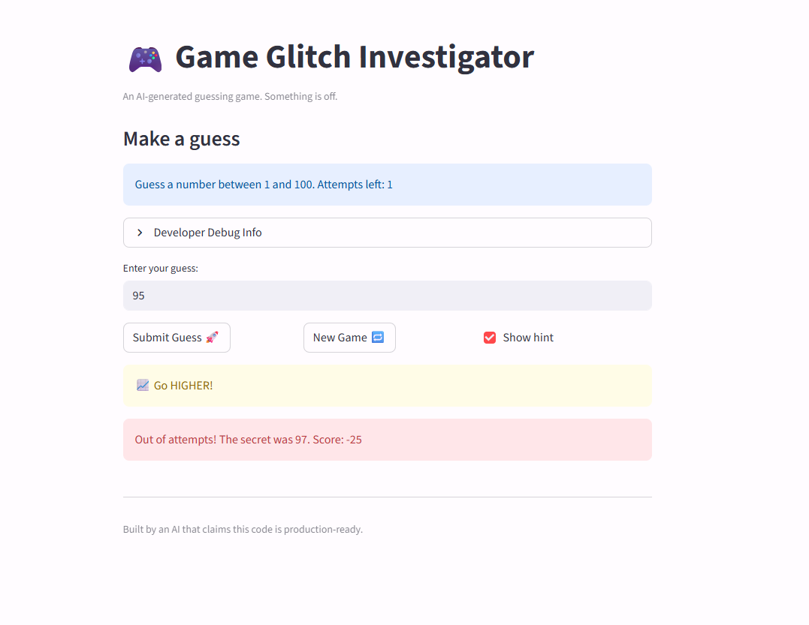

# 🎮 Game Glitch Investigator: The Impossible Guesser

## 🚨 The Situation

You asked an AI to build a simple "Number Guessing Game" using Streamlit.
It wrote the code, ran away, and now the game is unplayable. 

- You can't win.
- The hints lie to you.
- The secret number seems to have commitment issues.

## 🛠️ Setup

1. Install dependencies: `pip install -r requirements.txt`
2. Run the broken app: `python -m streamlit run app.py`

## 🕵️‍♂️ Your Mission

1. **Play the game.** Open the "Developer Debug Info" tab in the app to see the secret number. Try to win.
2. **Find the State Bug.** Why does the secret number change every time you click "Submit"? Ask ChatGPT: *"How do I keep a variable from resetting in Streamlit when I click a button?"*
3. **Fix the Logic.** The hints ("Higher/Lower") are wrong. Fix them.
4. **Refactor & Test.** - Move the logic into `logic_utils.py`.
   - Run `pytest` in your terminal.
   - Keep fixing until all tests pass!

## 📝 Document Your Experience

- [ ] Describe the game's purpose: The purpose of this game is for the user to guess a number between 1 and 100. They are allowed a certain number of hints to aid in finding the selected number. 
- [ ] Detail which bugs you found: I found issues with the hint feature where it shows the hints backwards. "Go HIGHER" when guess is too high, "Go LOWER" when too low. The messages are swapped. I also found secret number changes on every submit. Lastly, Attempts counter starts at 1 instead of 0. 
- [ ] Explain what fixes you applied: "Go HIGHER!" was shown when the guess was too high, and "Go LOWER!" when too low. Now they correctly point the player in the right direction. The buggy code was converting secret to a string on even-numbered attempts, so check_guess would compare int vs str.

## 📸 Demo

- [ ] []

## 🚀 Stretch Features

- [ ] [If you choose to complete Challenge 4, insert a screenshot of your Enhanced Game UI here]
